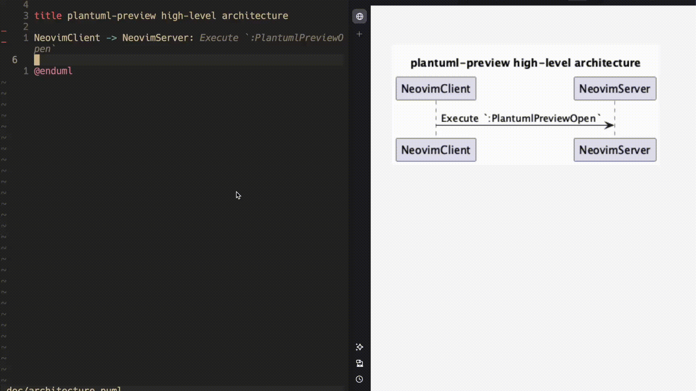

**BETA**

# plantuml-preview.nvim

Live preview and share PlantUML files. Pan diagrams in the browser and receive pretty error feedback - and all available offline!



## ⚡ Installation

Dependencies:

- [Deno](https://docs.deno.com/runtime/getting_started/installation/)
- [PlantUML](https://plantuml.com/starting)

Using [lazy.nvim](https://github.com/folke/lazy.nvim):

```lua
{
    "tobias-edwards/plantuml-preview.nvim",
    config = function()
        require("plantuml-preview").setup()
    end
}
```

If installed correctly, plugin health report should be OK:

```sh
:checkhealth plantuml-preview

# plantuml-preview:

# Checking for dependencies
# - ✅ OK deno installed.
# - ✅ OK plantuml installed.
# - ✅ OK plenary installed.
```

## 🔧 Configuration

Optional configuration can be passed into the `.setup()` function. Defaults are shown below:

```lua
require("plantuml-preview").setup({
    open_browser = true, -- Open the browser on :PlantumlPreviewOpen
    port = 3000, -- Live reload server port
})
```

## ✨ Commands

- `:PlantumlPreviewOpen` - start a live reload server on the PlantUML file
- `:PlantumlPreviewClose` - stop the live reload server
- `:PlantumlPreviewShareImage [png|svg|txt]` - generate an image URL of the PlantUML file (copied to clipboard). Default `png`
- `:PlantumlPreviewShareUML` - generate a PlantUML Web Editor URL (copied to clipboard)

## ⛰️ Roadmap

- [ ] Add `:help` documentation
- [ ] Add to Luarocks?
- [ ] Test and fix on Windows. MacOS working only atm
- [ ] Change browser title to filename
- [ ] Change callback syntax to `(error, callback)`--handle errors! More `pcall`?
- [ ] Allow to preview multiple plantuml buffers, increment port
- [ ] Drop Deno and run tcp-server from Lua
- [ ] Support multiple simultaneous servers
